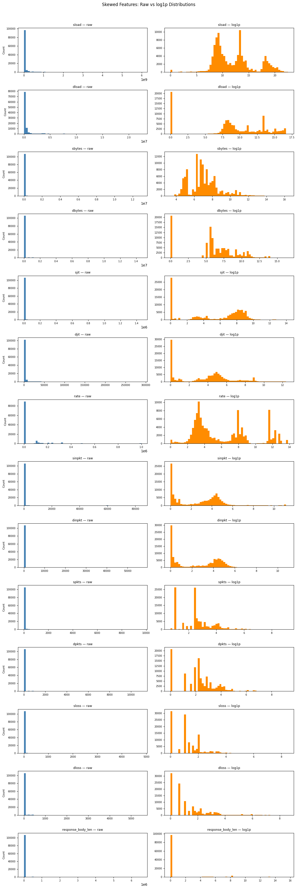
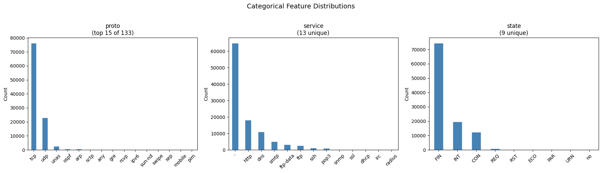
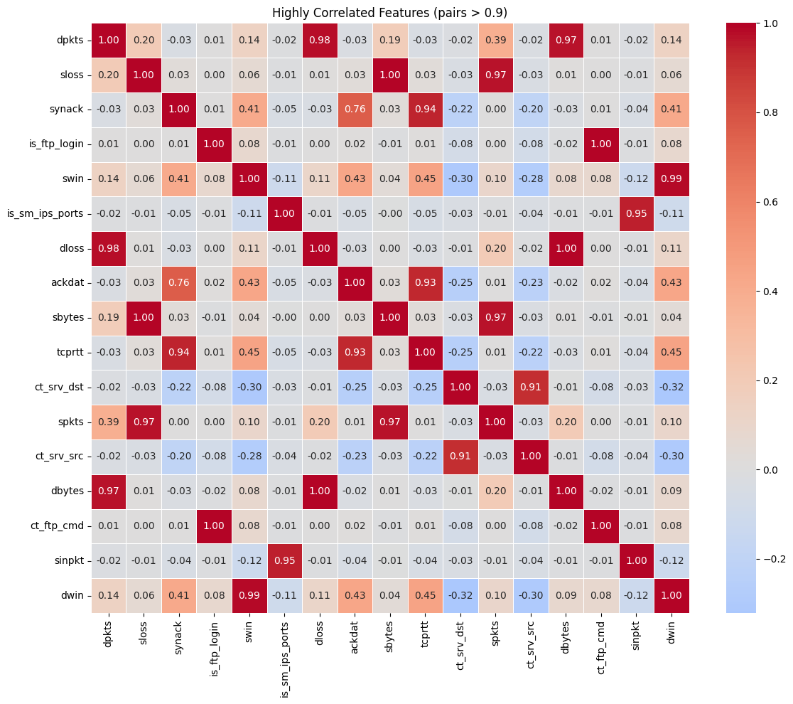

# Data Collection, Preprocessing, and Representation

## Dataset

We use the UNSW-NB15 dataset, a network intrusion detection benchmark created by the Australian Centre for Cyber Security. The dataset contains raw network traffic features extracted from packet captures using the Argus and Bro-IDS tools, labeled as either normal traffic or one of nine attack categories: Fuzzers, Analysis, Backdoor, DoS, Exploits, Generic, Reconnaissance, Shellcode, and Worms. Our task is binary classification: predicting whether a given network flow is normal (label=0) or an attack (label=1).

The dataset is provided pre-split into a training set and a test set. After duplicate removal (described below), the training set contains **107,740 records** and the test set contains **55,945 records**, each with 49 features prior to any engineering.

## Data Exploration

### Class Balance

The training set is nearly balanced: 51,890 normal flows (48.2%) and 55,850 attack flows (51.8%). This means class imbalance is not a significant concern, and standard metrics such as accuracy, F1, and/or ROC-AUC are informative.

### Feature Types

The dataset contains three types of features:

- **Categorical**: `proto` (network protocol), `service` (application-layer service), `state` (connection state). These are nominal and require encoding before use in any model.
- **Numerical — skewed**: 14 features including `sload`, `dload`, `sbytes`, `dbytes`, `sjit`, `djit`, `rate`, `sinpkt`, `dinpkt`, `spkts`, `dpkts`, `sloss`, `dloss`, and `response_body_len`. These features exhibit extreme right skew with ranges spanning billions, with the vast majority of values clustered near zero.
- **Numerical — approximately bounded**: The remaining numerical features (e.g. `dur`, `ttl` values, connection counters) have more moderate ranges and do not require log transformation.

### Skewness Justification

Plotting the raw distributions of the 14 skewed features reveals that nearly all values are very condensed or near zero, with extreme outliers taking values ranging from 10⁶–10⁹. Log transformation helps normalize the data by spreading values across a meaningful range, revealing distributions that cannot be seen in the raw data due to the outliers and massive range.

### Categorical Feature Distributions

The distributions of the three categorical features after bucketing are shown below. The plots show how of the few top categories are very dominant in each feature, justifying our bucketing approach. As explained in the preprocessing notebook, many of the categorical features had only a few unique values have significant counts, such as in `proto` where only 6 out of its 131 unique categories/values have counts of at least 100 in the dataset of 82,322. This further explains the reasons why we needed to bucket.

### Correlation

A correlation heatmap analysis was performed on numerical features (excluding `id`, `label`, `stcpb`, `dtcpb`). Highly correlated feature pairs (|r| > 0.9) were identified but no features were dropped on this basis as tree-based models are invariant to correlated features, and removing features could degrade logistic regression performance.

## Data Cleaning

### Duplicate Removal

Both the training and test sets contained duplicate records (rows identical across all columns except `id`). These were removed before any preprocessing to prevent data leakage, where a duplicate in the training set would appear in the test set and inflate evaluation metrics. Duplicates were identified and dropped using all columns except `id`.

### Irrelevant Column Removal

Four columns were dropped:
- **`id`**: A row identifier with no predictive value.
- **`attack_cat`**: The attack category label, as our problem is binary classification (attack vs normal) rather than a multi-class classification of what types of attacks.
- **`stcpb` and `dtcpb`**: Source and destination TCP base sequence numbers. These are random identifiers assigned per-connection with no predictive value.

## Feature Engineering

### Categorical Bucketing and One-Hot Encoding

The three categorical features (`proto`, `service`, `state`) have high cardinality in the raw data — `proto` alone has over 130 unique values. Most of these values are extremely rare. We apply frequency-based bucketing, retaining only the top categories and collapsing the rest into an `other` category:

| Feature | Retained Categories |
|---|---|
| `proto` | tcp, udp, unas, arp, ospf, sctp, other |
| `service` | -, http, dns, smtp, ftp-data, ftp, ssh, pop3, other |
| `state` | FIN, INT, CON, REQ, other |

After bucketing, we apply one-hot encoding (OHE) to each feature. This produces 7 + 9 + 5 = 21 binary indicator columns. The OHE column set is fit on the training set and applied to the test set, with any unseen categories filled with zeros.

### Log Transformation

For the 14 skewed numerical features, we apply `log1p` (log(1 + x)) rather than standard log as many features contain zero values, and `log(0)` is undefined.

### Feature Scaling

For models sensitive to feature scale (Logistic Regression and MLP), we apply `StandardScaler` to all numerical features after log transformation. The scaler is fit exclusively on the training set and applied to the test set using the saved mean and variance, preventing any test-set information from leaking into the scaling parameters.

Tree-based models (Random Forest and XGBoost) are scale-invariant so no scaling is applied for these models.

## Data Representation

We produce two final feature matrices from the same preprocessing pipeline:

| Matrix | Features Included | Used By |
|---|---|---|
| `df_model` | OHE columns + StandardScaler-scaled log-transformed and non-skewed numericals | Logistic Regression, MLP |
| `df_model_tree` | OHE columns + raw (unscaled) numericals | Random Forest, XGBoost |

Both matrices are 58 columns wide (21 OHE + 37 numerical) plus the binary label column.

All preprocessing artifacts (fitted scaler, OHE column sets, column lists) are serialized using `joblib` after fitting on the training set and reused for test set transformation, ensuring a pipeline without data leakage.

## Data Splitting and Hyperparameter Tuning

The train/test split is provided by the dataset. We do not perform an additional validation split. Instead, hyperparameter tuning for all models uses **3-fold cross-validation** on the training set via `RandomizedSearchCV`, with ROC-AUC as the scoring metric. This means the training set is internally partitioned into three folds for each candidate hyperparameter configuration, and the reported CV score is the mean ROC-AUC across folds. The test set is held out entirely and used only for final evaluation.
